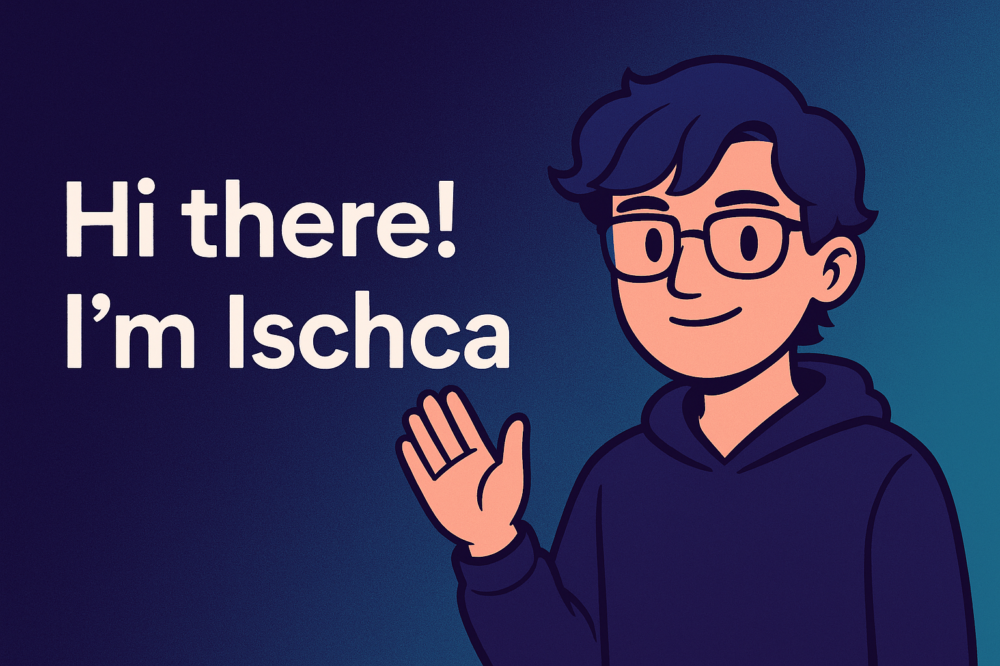

  

<h1 align="center">Ischca 👋</h1>

  <em>Full‑stack engineer @ Creatures Inc.</em>

---

## 🚀 Featured Projects

| | |
|---|---|
|  | **TaskVision** 「次の 1 時間」にフォーカスする TODO。  `Next.js` `Supabase` `TailwindCSS`  → [Product](https://task-vision.com/) |

---

## 🛠 Tech I Love

---

## 📈 GitHub Stats

  
  

---

## 🤝 Contact & Links

<!-- ### 📝 Maintainers Note
- 画像は 500 kB 以下推奨（表示高速化）。
- **自動更新**: `waka-readme`, `metrics`, ランダムポケモン生成などは GitHub Actions で定期実行。
- 四半期ごとに README をレビューして最新状態を保つこと。 -->
